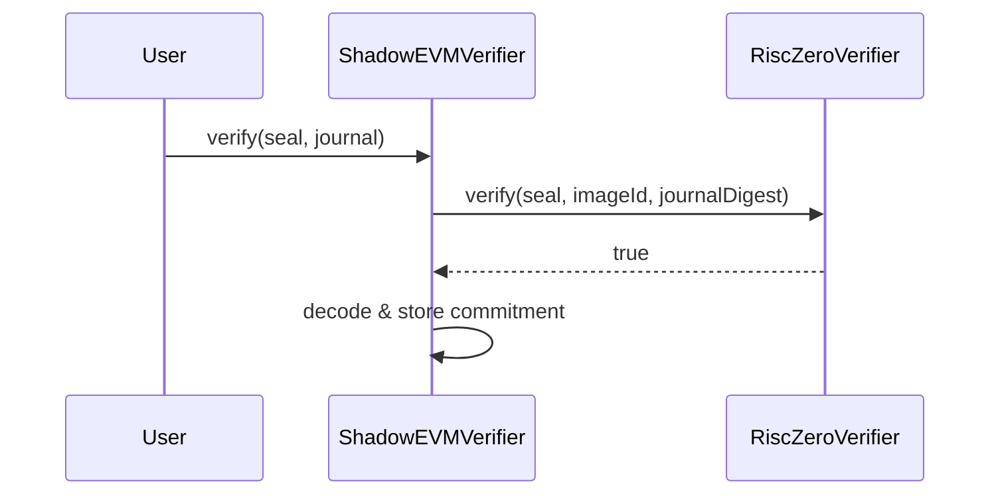

# Shadow-EVM Verifier Contracts

Solidity contracts for on-chain ZK proof verification.

## Contracts

| Contract | Description |
|----------|-------------|
| `ShadowEVMVerifier.sol` | Main verifier, stores commitments |
| `IRiscZeroVerifier.sol` | Interface for RISC Zero verifier |

## Deployment Parameters

### Image ID

The image ID is the cryptographic hash of the guest program. It must match between:
- Host (generates proofs)
- Verifier contract (validates proofs)

```solidity
bytes32 constant IMAGE_ID = 0x...; // Get from host after building guest
```

### RISC Zero Groth16 Verifier

Use the official RISC Zero verifier address for your network:

| Network | Verifier Address |
|---------|------------------|
| Ethereum Mainnet | `0x...` (check risc0.com/docs) |
| Sepolia | `0x...` |
| Local (Anvil) | Deploy `RiscZeroGroth16Verifier` |

## Deployment

```bash
# Set environment
export IMAGE_ID=0x...
export RISC0_VERIFIER=0x...
export RPC_URL=...
export PRIVATE_KEY=...

# Deploy
forge script script/Deploy.s.sol --broadcast --rpc-url $RPC_URL --private-key $PRIVATE_KEY

# Verify on Etherscan
forge verify-contract $DEPLOYED_ADDRESS ShadowEVMVerifier --chain sepolia
```

## Verification Flow



## Gas Costs

| Operation | Approximate Gas |
|-----------|-----------------|
| Proof verification | ~200,000 |
| Commitment storage | ~50,000 |
| Total | ~250,000 |

## Testing

```bash
cd contracts
forge test -vvv
```
