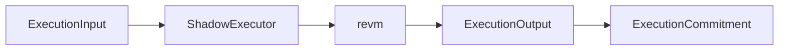
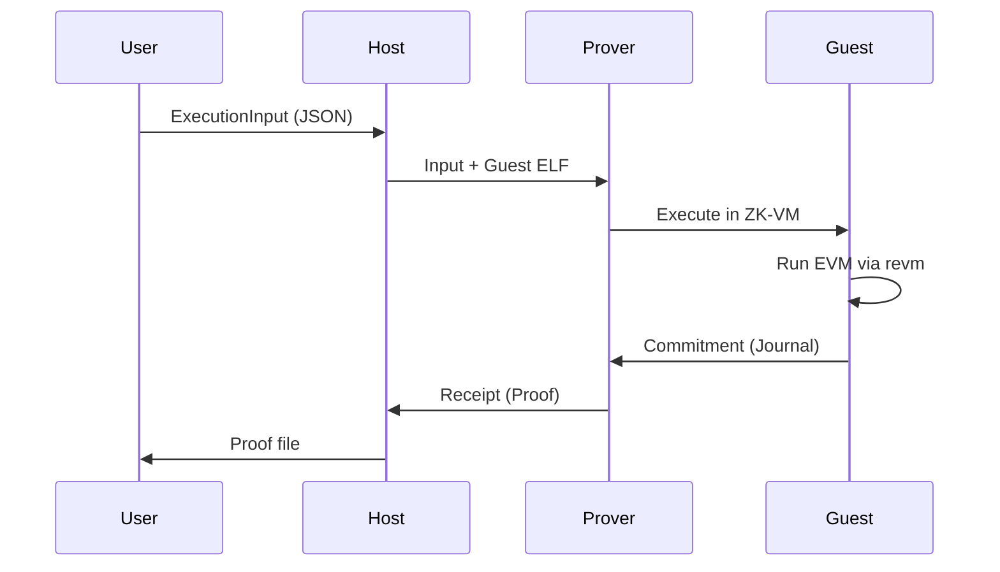
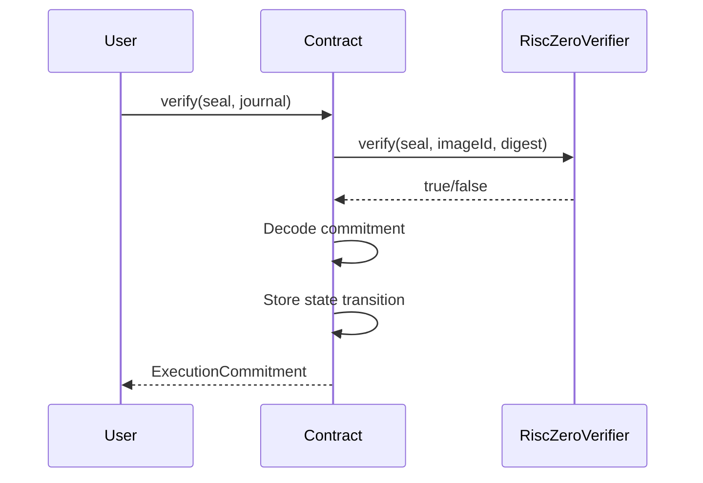

# Shadow-EVM Architecture

This document describes the architecture of the Shadow-EVM ZK Coprocessor.

## Overview

Shadow-EVM is a Zero-Knowledge Coprocessor that enables verifiable off-chain Ethereum execution. By embedding `revm` (Rust EVM) inside a RISC-V ZK-VM (RISC Zero), we can prove the correct execution of Solidity bytecode without running it on-chain.

```
┌─────────────────────────────────────────────────────────────────┐
│                         On-Chain                                 │
│  ┌─────────────┐    ┌──────────────────┐    ┌────────────────┐  │
│  │   dApp      │───▶│ ShadowEVMVerifier│───▶│ State Update   │  │
│  │  Contract   │    │    (Solidity)    │    │   Accepted     │  │
│  └─────────────┘    └──────────────────┘    └────────────────┘  │
│         │                    ▲                                   │
└─────────│────────────────────│───────────────────────────────────┘
          │                    │
          │              ZK Proof + Commitment
          │                    │
┌─────────│────────────────────│───────────────────────────────────┐
│         ▼                    │              Off-Chain            │
│  ┌─────────────┐    ┌──────────────────┐                        │
│  │   Host      │───▶│  RISC Zero       │                        │
│  │  (Prover)   │    │   Prover         │                        │
│  └─────────────┘    └──────────────────┘                        │
│         │                    ▲                                   │
│         │                    │                                   │
│         ▼                    │                                   │
│  ┌─────────────────────────────────────────────────────────────┐│
│  │                    RISC-V ZK-VM (Guest)                      ││
│  │  ┌───────────────┐    ┌───────────────┐    ┌──────────────┐ ││
│  │  │ExecutionInput │───▶│ ShadowExecutor│───▶│ExecutionOutput│││
│  │  │  (Pre-State)  │    │   (revm)      │    │ (Post-State) │ ││
│  │  └───────────────┘    └───────────────┘    └──────────────┘ ││
│  └─────────────────────────────────────────────────────────────┘│
└─────────────────────────────────────────────────────────────────┘
```

## Components

### 1. Core Library (`shadow-evm-core`)

The core library provides EVM execution logic that can run in both standard and `no_std` environments.

**Key Types:**

| Type | Description |
|------|-------------|
| `ExecutionInput` | Block env, transaction, and pre-state |
| `ExecutionOutput` | Return data, logs, gas used, post-state |
| `ExecutionCommitment` | Cryptographic binding of input to output |
| `ShadowExecutor` | Main executor wrapping revm |
| `InMemoryDB` | ZK-friendly state database |

**Execution Flow:**



### 2. ZKVM Guest (`zkvm/guest`)

The guest program runs inside the RISC-V ZK-VM. It:

1. Reads `ExecutionInput` from the host
2. Executes the EVM transaction using `ShadowExecutor`
3. Commits `ExecutionCommitment` to the journal

The guest is compiled to RISC-V ELF and executed inside RISC Zero's prover.

**Files:**

| File | Purpose |
|------|---------|
| `main.rs` | Entry point, orchestrates execution |
| `evm/executor.rs` | Wraps `ShadowExecutor` for ZK use |
| `evm/host_io.rs` | RISC Zero I/O primitives |
| `evm/state.rs` | ZK-compatible state wrapper |

### 3. ZKVM Host (`zkvm/host`)

The host runs on the developer's machine and:

1. Prepares `ExecutionInput`
2. Invokes the RISC Zero prover
3. Generates cryptographic receipts (proofs)
4. Exports proofs for on-chain verification

**CLI Commands:**

| Command | Description |
|---------|-------------|
| `prove` | Generate ZK proof for an execution |
| `verify` | Verify a ZK proof locally |
| `export` | Export proof for on-chain submission |
| `execute` | Run execution without proving (fast) |
| `sample` | Generate a sample input file |

### 4. Solidity Verifier (`contracts/`)

Smart contract for on-chain proof verification:

- Verifies RISC Zero Groth16 proofs
- Stores verified commitments
- Records state transitions
- Enables state chain verification

## Data Flow

### 1. Proof Generation



### 2. On-Chain Verification



## Security Model

1. **Computational Integrity**: The ZK proof guarantees the EVM execution was performed correctly
2. **State Binding**: Commitments cryptographically bind pre-state to post-state
3. **Determinism**: Same inputs always produce same outputs (required for ZK)
4. **On-Chain Verification**: Groth16 proofs can be verified in ~200k gas

## Performance Characteristics

| Metric | Value |
|--------|-------|
| Guest Execution | ~1-100M cycles depending on complexity |
| Proof Generation | ~1-60 minutes (depends on cycles) |
| On-Chain Verification | ~200k gas |
| Proof Size (Groth16) | ~256 bytes |

## Future Extensions

1. **Parallelization**: Split large computations across multiple proofs
2. **Recursive Proofs**: Aggregate multiple proofs into one
3. **Alternative ZK-VMs**: Support SP1, zkWASM
4. **State Compression**: Merkle proofs for partial state
